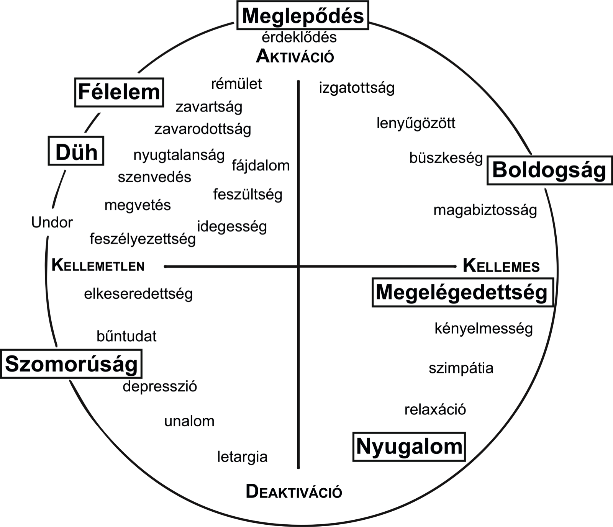

```{r setup, include=FALSE}
knitr::opts_chunk$set(echo = TRUE)
library(knitr)
library(rmarkdown)
library(tidyverse)
library(htmltools)
library(emojifont)
library(plotly)

emotiveEGG <- read.csv("/Users/martonbartok/Data/my_research/emotive/data/emotiveEGG.txt") %>%
  select(-1) %>%
  filter(phonLab != "A") %>%
  mutate(érzelem = factor(ifelse(emotion == "neu", "semleges", ifelse(emotion == "sup", "meglepődés", ifelse(emotion == "sad", "szomorúság", ifelse(emotion == "fea", "félelem", ifelse(emotion == "con", "megelégedettség", ifelse(emotion == "ang", "düh", ifelse(emotion == "cal", "nyugalom", ifelse(emotion == "hap", "boldogság", 99)))))))), levels=c('boldogság', 'nyugalom', 'düh', 'megelégedettség', 'félelem', 'szomorúság', 'meglepődés', 'semleges'), ordered=TRUE),
          emo = factor(ifelse(emotion == "neu", "\U0001F610", ifelse(emotion == "sup", "\U0001F62E", ifelse(emotion == "sad", "\U0001F622", ifelse(emotion == "fea", "\U0001F631", ifelse(emotion == "con", "\U0001F60E", ifelse(emotion == "ang", "\U0001F621", ifelse(emotion == "cal", "\U0001F60C", ifelse(emotion == "hap", "\U0001F603", 99)))))))), levels=c('\U0001F603', '\U0001F60C', '\U0001F621', '\U0001F60E', '\U0001F631', '\U0001F622', '\U0001F62E', '\U0001F610'), ordered=TRUE),
         activation = factor(ifelse(emotion == "neu", "neutral", ifelse(emotion == "sup", "high", ifelse(emotion == "sad", "low", ifelse(emotion == "fea", "high", ifelse(emotion == "con", "low", ifelse(emotion == "ang", "high", ifelse(emotion == "cal", "low", ifelse(emotion == "hap", "high", 99)))))))), levels=c("low", "neutral", "high"), ordered=TRUE),
         aktiváció = factor(ifelse(emotion == "neu", "semleges", ifelse(emotion == "sup", "magas", ifelse(emotion == "sad", "alacsony", ifelse(emotion == "fea", "magas", ifelse(emotion == "con", "alacsony", ifelse(emotion == "ang", "magas", ifelse(emotion == "cal", "alacsony", ifelse(emotion == "hap", "magas", 99)))))))), levels=c("alacsony", "semleges", "magas"), ordered=TRUE),
         valence = factor(ifelse(emotion == "neu", "neutral", ifelse(emotion == "sup", "neutral", ifelse(emotion == "sad", "negative", ifelse(emotion == "fea", "negative", ifelse(emotion == "con", "positive", ifelse(emotion == "ang", "negative", ifelse(emotion == "cal", "positive", ifelse(emotion == "hap", "positive", 99)))))))), levels=c("negative", "neutral", "positive"), ordered=TRUE),
         valencia = factor(ifelse(emotion == "neu", "semleges", ifelse(emotion == "sup", "semleges", ifelse(emotion == "sad", "negatív", ifelse(emotion == "fea", "negatív", ifelse(emotion == "con", "pozitív", ifelse(emotion == "ang", "negatív", ifelse(emotion == "cal", "pozitív", ifelse(emotion == "hap", "pozitív", 99)))))))), levels=c("negatív", "semleges", "pozitív"), ordered=TRUE),
         fonációtípus = factor(ifelse(phonLab == "M", "modális", ifelse(phonLab == "I", "irreguláris", "leheletes"))),
         nem = factor(ifelse(gender == "female", "nő", "férfi")),
         CqDegg = 1- OqDegg,
         CqHoward = 1- OqHoward)
```

```{r mean plotting function, echo= FALSE, warning=FALSE}

ggmean <- function(data, x, y, group, ylab, ylim = c(0, 350)){
  x <- enquo(x)
  y <- enquo(y)
  group <- enquo(group)
  
  gg <- data %>%
    ggplot(aes(x= !!x, y= !!y, fill= !!group, text = érzelem
                  #'<br>', group %>% quo_name() %>% firstup(), ": ", !!group,
                  )) +
      #geom_point() +
      stat_summary(fun.y=mean, geom="bar") +
      #stat_summary(fun.data = mean_cl_normal, geom = "errorbar", fun.args = list(mult = 1))+
      stat_summary(fun.data = mean_cl_normal, geom = "pointrange") +
      guides(fill=FALSE) +
      scale_fill_manual(values = c("#00BFC4", "#7CAE00", "#F8766D")) +
      ylab(ylab)+
      ylim(ylim) +
      xlab("")+
      coord_flip() +
      theme_light(base_size = 14) +
      theme(axis.text.y = element_text(size = 24), plot.margin = margin(10, 10, 10, 20))
  
  gg %>%
    ggplotly(tooltip = "text") %>%
    config(displayModeBar = F) %>%
    layout(xaxis=list(fixedrange=TRUE)) %>%
    layout(yaxis=list(fixedrange=TRUE)) %>%
    #layout(legend = list(orientation = 'h')) %>%
    layout(legend = list(x = 0, y = 100)) %>%
    layout(legend = list(font = list(size = 14))) %>%
    htmltools::div(class = "plotly", align="center")
}
```

```{r frequency plotting function, echo= FALSE, warning=FALSE}

ggfreq <- function(data, x, fill){
  x <- enquo(x)
  fill <- enquo(fill)
  
  gg <- data %>%
    ggplot(aes(x = !!x, text = !!fill)) +
    geom_bar(aes(fill = !!fill), position = "fill") +
    ylab("gyakoriság")+
    xlab("")+
    ylim(0,1)+
    coord_flip() +
    guides(fill=FALSE) +
    theme_light(base_size = 14) +
      theme(axis.text.y = element_text(size = 24), plot.margin = margin(10, 10, 10, 20))
  
  gg %>%
    ggplotly(tooltip = "text") %>%
    config(displayModeBar = F) %>%
    layout(xaxis=list(fixedrange=TRUE)) %>%
    layout(yaxis=list(fixedrange=TRUE)) %>%
    #layout(legend = list(orientation = 'h')) %>%
    layout(legend = list(x = 0, y = 100)) %>%
    layout(legend = list(font = list(size = 14))) %>%
    htmltools::div(class = "plotly", align="center")
}
```


# {.tabset .tabset-fade #choice}

**Az érzelmek kifejezésének számos módja van: arckifejezésünk, gesztusaink, testtartásunk, de még hangunk változásai is lehetőséget adnak érzelmi állapotaink megjelenítésére. De pontosan mik is ezek a változások? A különböző arckifejezések használata például olyannyira feltűnő, hogy még az írott nyelvi kommunikációban is használjuk stilizált változatukat hangulatunk kifejezésére 😮. Jóval kevesebbet tudunk azonban arról, hogyan is fejezünk ki érzelmeket hangunk megváltoztatásával. Az alábbiakban erre keressük a választ.**

Mennyire akarsz belemélyedni a témába? Ha a részletes verzió sem elég, [ide kattintva](http://ojs3.mtak.hu/index.php/beszkut/article/view/1020) olvasható a kísérletet teljes részletességgel bemutató tanulmány [@bartok2018gegemHukodes].

## Részletes (kb. 15 perc)

### Szándékolt érzelemkifejezés

Az érzelmek kifejezésére szolgáló összetett mechanizmusok közül most a beszédtevékenységre fókuszálunk: a kísérlet célja annak megragadása volt, hogy **hogyan fejezünk ki beszédünk szándékos megváltoztatásával különböző érzelmi állapotokat**. Az érzelmek kifejezését eljátszott érzelmekről készített felvételek elemzésével végeztük, és a beszédtevékenység rendkívül összetett folyamatán belül egy, a beszédfolyamat elejére helyezhető beszédképzési (*artikulációs*) tevékenység változásaira koncentráltunk: azt vizsgáltuk, hogy hogyan változik a gége működése az érzelemkifejezés során.

### A gége szerepe a beszédképzésben

A gége rendkívül fontos szerepet tölt be a beszédképzésben: **a tüdőből kiáramló levegő az itt található hangszalagokat elérve akadályba ütközik, majd mikor kellő légnyomás gyűlik fel, szétfeszíti azokat - ezután pedig a szűk résen kiáramló levegő szívó hatása következtében a hangszalagok ismét összezáródnak. Így jön létre a periodikusan érintkező és szétváló hangszalagok között áthaladó légáram, a zönge**. Ez az összetett hanghullám ezt követően a gége fölötti (szupraglottális) üregrendszer aktuális alakjától - tehát például a nyelv helyzetétől, az ajkak kerekítettségétől, az orrüreget elzáró nyelvcsap pozíciójától - függően különböző beszédhangokként valósul meg.

A zöngeképzés (*fonáció*) során tehát még nem dől el, hogy milyen beszédhangot is ejtünk - ugyanakkor beszédünk számos jellemzője ekkor határozódik meg: a hangszalagok működésének mikéntje befolyásolja például a hang magasságát. *Fontos megjegyezni, hogy a zöngeképzés - nomen est omen - csak a zöngés beszédhangok (magánhangzók és zöngés mássalhangzók) esetén megy végbe - a zöngétlen mássalhangzók, illetve suttogás esetén nem képzünk zöngét, ilyenkor a levegő szabadon áramlik a hangszalagok közötti résen.*

<center>

<iframe width="560" height="315" src="https://www.youtube.com/embed/Aoa_N1vQS4M?start=47" frameborder="0" allowfullscreen></iframe>

</center>

#### A zönge tulajdonságai

Ezt a gége szintjén létrejövő hanghullámot jellemezhetjük egyrészt a hangszalagok nyitódásából és záródásából álló **periódusok gyakoriságával, azaz a zönge *alapfrekvenciájá*val**, ami nagyrészt meghatározza, hogy milyen magasnak hallunk egy hangot - a gyakrabban szétváló és érintkező hangszalagok magasabb, a ritkábban ismétlődő zöngeperiódusok pedig alacsonyabb hangmagassághoz vezetnek. Az alapfrekvencia egyrészt függ hangszalagjaink méretétől, ez eredményezi azt, hogy a férfiak hangja általában mélyebb, mint a kisebb hangszalagokkal rendelkező nők, vagy gyermekek hangja. Másrészt hangszalagjaink hosszanti feszítettségének megváltoztatásával képesek vagyunk az alapfrekvencia szándékos befolyásolására - a feszítettebb hangszalagok magasabb, a lazább hangszalagok alacsonyabb alapfrekvenciához vezetnek. Az alapfrekvencián túl többek között **jellemzi még a zöngét a tüdőből kiáramló levegő nyomásszintje, az *intenzitás*,** illetve az ezzel összefüggésben észlelt hangosságérzet.

Ezen a két paraméteren túl jellemezhetjük még a zöngét a fonáció típusával. Ez a tulajdonság, ahogy a neve is mutatja, egymástól valamilyen mértékben elkülöníthető típusokra, kategóriákra osztja a zönge különböző megvalósulásait. Ez a kategorizáció a hangszalagok alapértelmezettnek, tipikusnak tekintett működésével, az úgynevezett modális fonációtípussal állít szembe más zöngeképzési módokat. Ilyen **fonációtípus** például az *irreguláris zönge*, melynek képzése során a hangszalagok hosszanti feszítetsége kisebb, ugyanakkor jobban egymásnak feszülnek, mint modális zönge esetén, ennek következtében recsegőssé, rekedtessé válik a beszéd. Egy másik fonációtípus, a *leheletes zönge* esetén, ahogy neve is mutatja, szinte folyamatosan áramlik a levegő a hangszalagok közötti résen, mivel a hangszalagokat egymás felé közelítő izmok feszítettsége ez esetben a modális zöngénél jóval alacsonyabb mértékű [@laver1980phonetic]. Ez a folyamatos áramlás a [h] hanghoz hasonló zörejelemek megjelenéséhez vezet.

<audio id="modal" src="wav/modal.wav"></audio> <button class="btn_audio" onclick="document.getElementById('modal').play()">Modális zönge 🔈</button>
<audio id="creak" src="wav/creak.wav"></audio> <button class="btn_audio" onclick="document.getElementById('creak').play()">Irreguláris zönge 🔈</button>
<audio id="breathy" src="wav/breathy.wav"></audio> <button class="btn_audio" onclick="document.getElementById('breathy').play()">Leheletes zönge 🔈</button>

### Mit tudunk már az érzelmek és a zöngeképzés kapcsolatáról?

Az érzelemkifejezés és a zöngeképzés összefüggéseit vizsgáló kutatásokból egy viszonylag egységes tendencia rajzolódik ki: a beszédképzés több részfolyamatával együtt a zönge képzése is az érzelmekre jellemző agyi aktiváció (*arousal*) szinjével van összefüggésben. **A magas aktivációjú érzelmek (pl. meglepődés, félelem, düh) kifejezése jellemzően magasabb alapfrekvenciájú zöngével történik, mint az alacsonyabb aktivációjúaké (pl. megelégedettség, unalom)** - attól függetlenül, hogy az adott érzelem negatív vagy pozitív, azaz milyen *valenciájú* [@scherer1986vocal]. Bár magyar beszédre vonatkozóan még nem születtek ezt vizsgáló kutatások, mivel ez a mintázat több, egymástól független nyelv esetén megjelenik, feltételeztük, hogy hasonló tendenciát tapasztalhatunk magyar beszélőknél.

Azt is feltételeztük, hogy **amennyiben nem csak az alapfrekvencia értékének változásait figyeljük meg a kifejezett érzelem függvényében, hanem a fonáció típusát is figyelembe vesszük, illetve a fonációtípusok hátterében álló artikulációs különbségeket erre megfelelő műszerek segítségével vizsgáljuk, az tovább árnyalhatja a képet**: valószínűleg az érzelmek valenciája függvényében is tapasztalhatunk eltéréseket.

<center>



</center>

### Anyag, módszer, kísérleti személyek

A kísérlet során az **adatközlőket arra kértük, hogy játszanak el különböző érzelmeket**: azt az utasítás adtuk nekik, hogy **egy [á] hangot kiejtve** fejezzék ki az adott érzelmi állapotot. A vizsgált érzelemek a következőek voltak: **meglepődés, boldogság, megelégedettség, nyugalom, szomorúság, düh, félelem**, illetve minden beszélővel rögzítettünk érzelmileg semleges megvalósulásokat is. Összesen 10 fiatal (19-32 éves) adatközlő, 5 férfi és 5 nő hanganyagát rögzítettük, érzelmenként 3 ismétléssel. A hangfelvételek rögzítése mellett egy, a hangszalagok érintkezésének mértékét rögzítő műszerrel, az elektroglottográffal is rögzítettünk felvételeket.

Az **elektroglottográf (EGG)** működési elve, hogy két elektródát helyezünk a nyakra a pajzsporc (ádámcsutka) magasságában, melyek segítségével kisfeszültségű - az egészségre teljes mértékben ártalmatlan - elektromos áramot vezetünk keresztül a kísérleti alany torkán. A nyaki szöveteken keresztülhaladó áram feszültségének változásából a hangszalagok érintkezésének mértékére tudunk következtetni [@childers1985critical].

<center>


</center>

Az elemzés során elsőként a hangfelvételek hullámformája, valamint hallás alapján elkülönítettük a beszédhangokon belül megjelenő különböző fonációtípúsokat. Ezen túl a modális fonációjú szakaszokon megmértük az alapfrekvencia átlagos értékét, valamint a hangszalagok érintkezésének egy zöngeperiódusra levetített arányának átlagát (kontakt kvóciens, vagy röviden CQ). Az alapfrekvencia értékét hertzben, azaz az egy másodpercre jutó periódusok számával fejezzük ki, a kontakt kvóciens pedig egy 0 (egyáltalán nem érintkeznek a hangszalagok) és 1 (a hangszalagok a teljes periódus ideje alatt érintkeznek) közötti szám [@rothenberg1992multichannel]. Persze mivel a zöngeképzés éppen a hangszalagok érintkezésének és szétválásának ciklikus egymásutánjából áll, ilyen értékeket nem mérhetünk, leggyakrabban a CQ értéke valamivel kevesebb, mint 0.5, tehát a zöngeperiódus valamivel kevesebb, mint felében érintkeznek a hangszalagok.

### Eredmények

Összesen 240 á hangot elemeztünk (10 beszélő x 8 érzelem x 3 ismétlés). Például egy férfi beszélő ejtésében ilyenek voltak a vizsgált érzelmek:


<audio id="neutral" src="wav/neutral.wav"></audio> <button class="btn_audio" onclick="document.getElementById('neutral').play()">😐 semleges 🔈</button>
<audio id="suprised" src="wav/suprised.wav"></audio> <button class="btn_audio" onclick="document.getElementById('suprised').play()">😮 meglepődés 🔈</button>
<audio id="happy" src="wav/happy.wav"></audio> <button class="btn_audio" onclick="document.getElementById('happy').play()">😃 boldogság 🔈</button>
<audio id="content" src="wav/content.wav"></audio> <button class="btn_audio" onclick="document.getElementById('content').play()">😎 megelégedettség 🔈</button>
<audio id="calm" src="wav/calm.wav"></audio> <button class="btn_audio" onclick="document.getElementById('calm').play()">😌 nyugalom 🔈</button>
<audio id="sad" src="wav/sad.wav"></audio> <button class="btn_audio" onclick="document.getElementById('sad').play()">😢 szomorúság 🔈</button>
<audio id="angry" src="wav/angry.wav"></audio> <button class="btn_audio" onclick="document.getElementById('angry').play()">😡 düh 🔈</button>
<audio id="scared" src="wav/scared.wav"></audio> <button class="btn_audio" onclick="document.getElementById('scared').play()">😱 félelem 🔈</button>

Az alábbiakban azokra az eltérésekre koncentrálunk, melyek statisztikailag szignifikánsak voltak 95%-os konfidenciaszintnél (tehát amely esetekben 95 százalékos valószínűséggel mondhatjuk, hogy a két összehasonlított érték -például az alacsony és a magas aktivációjú érzelemekre jellemző alapfrekvencia értéke- valóban különbözik egymástól, nem csak az általunk vizsgált minta esetén van eltérés). *[A statisztikai próbákat lineáris kevert modellekkel vizsgáltuk, az adatközlő személyét random hatásként beállítva.]*

#### Alapfrekvencia {.tabset .tabset-fade .tabset-pills}

**Az alapfrekvencia értékei** feltételezésünket alátámasztva **átlagosan `r emotiveEGG %>% filter(phonLab == "M", activation != "neutral") %>% group_by(activation) %>% summarize(mean = mean(f0)) %>% mutate(difference = mean - lag(mean)) %>% slice(2) %>% select(difference) %>% round(0)` Hz-cel magasabbak voltak magas aktivációjú érzelmeknél, mint alacsony aktivációjúaknál.** Az eltérés mértéke férfiaknál kisebb (`r emotiveEGG %>% filter(phonLab == "M", activation != "neutral") %>% group_by(gender, activation) %>% summarize(mean = mean(f0)) %>% mutate(difference = mean - lag(mean)) %>% slice(2) %>% filter(gender == "male") %>% ungroup() %>% select(difference) %>% round(0)` Hz), mint nők beszédében (`r emotiveEGG %>% filter(phonLab == "M", activation != "neutral") %>% group_by(gender, activation) %>% summarize(mean = mean(f0)) %>% mutate(difference = mean - lag(mean)) %>% slice(2) %>% filter(gender == "female") %>% ungroup() %>% select(difference) %>% round(0)` Hz). Az aktivációnak ez a gyakran megfigyelt hatása [@scherer1986vocal] egyébként feltehetően arra a **pszichofiziológiai ok**ra vezethető vissza, hogy a magasabb aktivációjú érzelemek esetén megnőhet az általános izomfeszítettség, ami a gége esetén a hangszalagok nagyobb hosszanti feszítettségéhez, és így az alapfrekvencia megemelkedéséhez vezethet. Bár ebben a kísérletben nem érzelmek valódi megtapasztalása során vizsgáltuk a beszéd változásait, úgy tűnik, hogy **a valódi érzelmi hatások során bekövetkező változások meghatározhatják azt, hogyan is játtszunk el különböző érzelmeket.**

##### Minden beszélő {.tabset .tabset-fade .tabset-pills}

###### Aktiváció

```{r, echo= FALSE, warning=FALSE}
emotiveEGG %>% filter(phonLab == "M") %>%
  ggmean(emo, f0, aktiváció, "alapfrekvencia (Hz)", ylim = c(0, 350))
```

<p class="plotly_cap">Az oszlopok az átlagos értéket, a vonalak a 95%-os konfidenciaintervallumot jelölik: az érték 95%-os valószínűséggel ebbe az intervallumba esik. Az ábra interaktív!<p>

###### Valencia

```{r, echo= FALSE, warning=FALSE}
emotiveEGG %>% filter(phonLab == "M") %>%
  ggmean(emo, f0, valencia, "alapfrekvencia (hertz)", ylim = c(0, 350))
```

<p class="plotly_cap">Az oszlopok az átlagos értéket, a vonalak a 95%-os konfidenciaintervallumot jelölik: az érték 95%-os valószínűséggel ebbe az intervallumba esik. Az ábra interaktív!<p>

##### Nő {.tabset .tabset-fade .tabset-pills}

###### Aktiváció

```{r, echo= FALSE, warning=FALSE}
emotiveEGG %>% filter(phonLab == "M", nem == "nő") %>%
  ggmean(emo, f0, aktiváció, "alapfrekvencia (hertz)", ylim = c(0, 350))
```

<p class="plotly_cap">Az oszlopok az átlagos értéket, a vonalak a 95%-os konfidenciaintervallumot jelölik: az érték 95%-os valószínűséggel ebbe az intervallumba esik. Az ábra interaktív!<p>

###### Valencia

```{r, echo= FALSE, warning=FALSE}
emotiveEGG %>% filter(phonLab == "M", nem == "nő") %>%
  ggmean(emo, f0, valencia, "alapfrekvencia (hertz)", ylim = c(0, 350))
```

<p class="plotly_cap">Az oszlopok az átlagos értéket, a vonalak a 95%-os konfidenciaintervallumot jelölik: az érték 95%-os valószínűséggel ebbe az intervallumba esik. Az ábra interaktív!<p>

##### Férfi {.tabset .tabset-fade .tabset-pills}

###### Aktiváció

```{r, echo= FALSE, warning=FALSE}
emotiveEGG %>% filter(phonLab == "M", nem == "férfi") %>%
  ggmean(emo, f0, aktiváció, "alapfrekvencia (hertz)", ylim = c(0, 350))
```

<p class="plotly_cap">Az oszlopok az átlagos értéket, a vonalak a 95%-os konfidenciaintervallumot jelölik: az érték 95%-os valószínűséggel ebbe az intervallumba esik. Az ábra interaktív!<p>

###### Valencia

```{r, echo= FALSE, warning=FALSE}
emotiveEGG %>% filter(phonLab == "M", nem == "férfi") %>%
  ggmean(emo, f0, valencia, "alapfrekvencia (hertz)", ylim = c(0, 350))
```

<p class="plotly_cap">Az oszlopok az átlagos értéket, a vonalak a 95%-os konfidenciaintervallumot jelölik: az érték 95%-os valószínűséggel ebbe az intervallumba esik. Az ábra interaktív!<p>

#### A hangszalagok érintkezésének aránya {.tabset .tabset-fade .tabset-pills}

**A hangszalagok érintkezésének arányát vizsgálva** öszetettebb hatást figyelhettünk meg. Egyrészt csak a férfiaknál volt megfigyelhető szignifikáns eltérés, másrészt nem önmagában az aktiváció vagy a valencia fejti ki hatását a hangszalagérintkezésre, hanem ez a két tényező kombinálódva. A kontakt kvóciens a negatív valenciájú érzelmek esetén mutatott különbséget az aktiváció hatására: **a magas aktivációjú *düh és félelem* esetében átlagosan `r emotiveEGG %>% filter(phonLab == "M", gender == "male", activation != "neutral") %>% group_by(activation) %>% summarize(mean = mean(CqHoward)) %>% mutate(difference = mean - lag(mean)) %>% slice(2) %>% select(difference) %>% round(2)`-al magasabb CQ értékeket mértünk, mint a szintén negatív valenciájú, de alacsony aktivációjú  *szomorúság* esetén.**

##### Minden beszélő {.tabset .tabset-fade .tabset-pills}

###### Aktiváció

```{r, echo= FALSE, warning=FALSE}
emotiveEGG %>% filter(phonLab == "M") %>%
  ggmean(emo, CqHoward, aktiváció, "kontakt kvóciens", ylim = c(0, 0.65))
```

<p class="plotly_cap">Az oszlopok az átlagos értéket, a vonalak a 95%-os konfidenciaintervallumot jelölik: az érték 95%-os valószínűséggel ebbe az intervallumba esik. Az ábra interaktív!<p>

###### Valencia

```{r, echo= FALSE, warning=FALSE}
emotiveEGG %>% filter(phonLab == "M") %>%
  ggmean(emo, CqHoward, valencia, "kontakt kvóciens", ylim = c(0, 0.65))
```

<p class="plotly_cap">Az oszlopok az átlagos értéket, a vonalak a 95%-os konfidenciaintervallumot jelölik: az érték 95%-os valószínűséggel ebbe az intervallumba esik. Az ábra interaktív!<p>

##### Nő {.tabset .tabset-fade .tabset-pills}

###### Aktiváció

```{r, echo= FALSE, warning=FALSE}
emotiveEGG %>% filter(phonLab == "M", nem == "nő") %>%
  ggmean(emo, CqHoward, aktiváció, "kontakt kvóciens", ylim = c(0, 0.65))
```

<p class="plotly_cap">Az oszlopok az átlagos értéket, a vonalak a 95%-os konfidenciaintervallumot jelölik: az érték 95%-os valószínűséggel ebbe az intervallumba esik. Az ábra interaktív!<p>

###### Valencia

```{r, echo= FALSE, warning=FALSE}
emotiveEGG %>% filter(phonLab == "M", nem == "nő") %>%
  ggmean(emo, CqHoward, valencia, "kontakt kvóciens", ylim = c(0, 0.65))
```

<p class="plotly_cap">Az oszlopok az átlagos értéket, a vonalak a 95%-os konfidenciaintervallumot jelölik: az érték 95%-os valószínűséggel ebbe az intervallumba esik. Az ábra interaktív!<p>

##### Férfi {.tabset .tabset-fade .tabset-pills}

###### Aktiváció

```{r, echo= FALSE, warning=FALSE}
emotiveEGG %>% filter(phonLab == "M", nem == "férfi") %>%
  ggmean(emo, CqHoward, aktiváció, "kontakt kvóciens", ylim = c(0, 0.65))
```

<p class="plotly_cap">Az oszlopok az átlagos értéket, a vonalak a 95%-os konfidenciaintervallumot jelölik: az érték 95%-os valószínűséggel ebbe az intervallumba esik. Az ábra interaktív!<p>

###### Valencia

```{r, echo= FALSE, warning=FALSE}
emotiveEGG %>% filter(phonLab == "M", nem == "férfi") %>%
  ggmean(emo, CqHoward, valencia, "kontakt kvóciens", ylim = c(0, 0.65))
```

<p class="plotly_cap">Az oszlopok az átlagos értéket, a vonalak a 95%-os konfidenciaintervallumot jelölik: az érték 95%-os valószínűséggel ebbe az intervallumba esik. Az ábra interaktív!<p>

#### Fonációtípusok {.tabset .tabset-fade .tabset-pills}

Az irreguláris zönge gyakorisága nem mutatott eltéréseket a kifejezett érzelem valenciája vagy aktivációja szerint, viszont néhány érzelem esetében kiugró gyakoriságokat figyeltünk meg: férfiaknál a beszédhangok 29, nőknél 26%-a tartalmazott irreguláris zöngét a DÜH kifejezésekor. A nők esetében emellett a MEGELÉGEDETTSÉGet kifejező mondatszók is nagy, 34%-os arányban tartalmaztak irreguláris zöngét.
**A leheletes fonáció** mind a férfiak, mind a nők esetében **a pozitív, alacsonyabb aktivációjú érzelmek kifejezése** esetén volt nagyobb arányban jellemző, ez nagymértékben egybecseng  @laver1980phonetic megfigyeléseivel, aki a **leheletes zöngét az intimitás és a bizalmasság kifejezés**éhez köti - ezek az érzelmek szintén alacsony aktivációval és pozitív valenciával jellemezhetők.

##### Minden beszélő

```{r, echo= FALSE}

emotiveEGG %>%
  ggfreq(emo, fonációtípus)

```


##### Nők

```{r, echo= FALSE}
emotiveEGG %>%
  filter(nem == "nő") %>%
  ggfreq(emo, fonációtípus)
```

##### Férfiak

```{r, echo= FALSE}
emotiveEGG %>%
  filter(nem == "férfi") %>%
  ggfreq(emo, fonációtípus)
```


## Közepes (kb. 7 perc)

### A zöngeképzés

A kísérletben a beszédképzés vizsgálatán belül arra koncentrálunk, hogy a hangszalagok működése hogyan változik a különböző érzelmek kifejezésekor. **A hangszalagok** zöngés hangok képzése során **másodpercenként akár több százszor is szétválnak** (majd újra összezáródnak) **a tüdőből érkező légáram hatására**: ez a folyamat a zöngeképzés, aminek mikéntje hangunk számos jellegzetességét meghatározza.

<center>

<iframe width="560" height="315" src="https://www.youtube.com/embed/Aoa_N1vQS4M?start=47" frameborder="0" allowfullscreen></iframe>

</center>

A kísérletben a zöngeképzés két tulajdonságának változásait vizsgáljuk:

  * a hangszalagok érintkezésének-szétnyílásának gyakoriságát, azaz **a zönge alapfrekvenciáját** (minél több ilyen periódus figyelhető meg adott időegység alatt, annál magasabb hangot észlelünk). Ezt a paramétert főként a hangszalagok mérete (a férfiak hangja általában mélyebb, mint a kisebb hangszalagokkal rendelkező nők, vagy gyermekek hangja) és hosszanti feszítettsége befolyásolja (a feszítettebb hangszalagok magasabb, a lazább hangszalagok alacsonyabb alapfrekvenciához vezetnek),
  * vizsgáljuk a zöngeképzés (vagy *fonáció*) típusát - ez a tulajdonság, ahogy a neve is mutatja, egymástól valamilyen mértékben elkülöníthető típusokra, kategóriákra osztja a zönge különböző megvalósulásait. Ez a kategorizáció a hangszalagok alapértelmezettnek, tipikusnak tekintett működésével, az úgynevezett modális fonációtípussal állít szembe más zöngeképzési módokat. Ilyen **fonációtípus**ok például az *irreguláris zönge*, melynek képzése során a hangszalagok hosszanti feszítetsége kisebb, ugyanakkor jobban egymásnak feszülnek, mint modális zönge esetén, ennek következtében recsegőssé, rekedtessé válik a beszéd. *Leheletes zönge* esetén, ahogy neve is mutatja, szinte folyamatosan áramlik a levegő a hangszalagok közötti résen, mivel a hangszalagokat egymás felé közelítő izmok feszítettsége ez esetben a modális zöngénél jóval alacsonyabb mértékű [@laver1980phonetic]. Ez a folyamatos áramlás a [h] hanghoz hasonló zörejelemek megjelenéséhez vezet.
  
<audio id="modal" src="wav/modal.wav"></audio> <button class="btn_audio" onclick="document.getElementById('modal').play()">Modális zönge 🔈</button>
<audio id="creak" src="wav/creak.wav"></audio> <button class="btn_audio" onclick="document.getElementById('creak').play()">Irreguláris zönge 🔈</button>
<audio id="breathy" src="wav/breathy.wav"></audio> <button class="btn_audio" onclick="document.getElementById('breathy').play()">Leheletes zönge 🔈</button>

### Mit tudunk már az érzelmek és a zöngeképzés kapcsolatáról?

Az érzelemkifejezés és a zöngeképzés összefüggéseit vizsgáló kutatásokból egy viszonylag egységes tendencia rajzolódik ki: a beszédképzés több részfolyamatával együtt a zönge képzése is az érzelmekre jellemző agyi aktiváció (*arousal*) szinjével van összefüggésben. **A magas aktivációjú érzelmek (pl. meglepődés, félelem, düh) kifejezése jellemzően magasabb alapfrekvenciájú zöngével történik, mint az alacsonyabb aktivációjúaké (pl. megelégedettség, unalom)** - attól függetlenül, hogy az adott érzelem negatív vagy pozitív, azaz milyen *valenciájú* [@scherer1986vocal]. Bár magyar beszédre vonatkozóan még nem születtek ezt vizsgáló kutatások, mivel ez a mintázat több, egymástól független nyelv esetén megjelenik, feltételeztük, hogy hasonló tendenciát tapasztalunk magyar beszélőknél.

Azt is feltételeztük, hogy **amennyiben nem csak az alapfrekvencia értékének változásait figyeljük meg a kifejezett érzelem függvényében, hanem a fonáció típusát is figyelembe vesszük, az tovább árnyalhatja a képet**: valószínűleg az érzelmek valenciája függvényében is tapasztalhatunk eltéréseket.

<center>


</center>

### Anyag, módszer, kísérleti személyek

A kísérlet során az **adatközlőket arra kértük, hogy játszanak el különböző érzelmeket**: azt az utasítás adtuk nekik, hogy **egy [á] hangot kiejtve** fejezzék ki az adott érzelmi állapotot. Az érzelemek a következőek voltak: **meglepődés, boldogság, megelégedettség, nyugalom, szomorúság, düh, félelem**, illetve minden beszélővel rögzítettünk érzelmileg semleges megvalósulásokat is. Összesen 10 fiatal (19-32 éves) adatközlő, 5 férfi és 5 nő hanganyagát rögzítettük, érzelmenként 3 ismétléssel.

### Eredmények

Összesen 240 [á] hangot elemeztünk. Például egy férfi beszélő ejtésében ilyenek voltak a vizsgált érzelmek:

<audio id="neutral" src="wav/neutral.wav"></audio> <button class="btn_audio" onclick="document.getElementById('neutral').play()">😐 semleges 🔈</button>
<audio id="suprised" src="wav/suprised.wav"></audio> <button class="btn_audio" onclick="document.getElementById('suprised').play()">😮 meglepődés 🔈</button>
<audio id="happy" src="wav/happy.wav"></audio> <button class="btn_audio" onclick="document.getElementById('happy').play()">😃 boldogság 🔈</button>
<audio id="content" src="wav/content.wav"></audio> <button class="btn_audio" onclick="document.getElementById('content').play()">😎 megelégedettség 🔈</button>
<audio id="calm" src="wav/calm.wav"></audio> <button class="btn_audio" onclick="document.getElementById('calm').play()">😌 nyugalom 🔈</button>
<audio id="sad" src="wav/sad.wav"></audio> <button class="btn_audio" onclick="document.getElementById('sad').play()">😢 szomorúság 🔈</button>
<audio id="angry" src="wav/angry.wav"></audio> <button class="btn_audio" onclick="document.getElementById('angry').play()">😡 düh 🔈</button>
<audio id="scared" src="wav/scared.wav"></audio> <button class="btn_audio" onclick="document.getElementById('scared').play()">😱 félelem 🔈</button>

#### Alapfrekvencia {.tabset .tabset-fade .tabset-pills}

**Az alapfrekvencia értékei** feltételezésünket alátámasztva **átlagosan `r emotiveEGG %>% filter(phonLab == "M", activation != "neutral") %>% group_by(activation) %>% summarize(mean = mean(f0)) %>% mutate(difference = mean - lag(mean)) %>% slice(2) %>% select(difference) %>% round(0)` Hz-cel magasabbak voltak magas aktivációjú érzelmeknél, mint alacsony aktivációjúaknál.** Az eltérés mértéke férfiaknál kisebb (`r emotiveEGG %>% filter(phonLab == "M", activation != "neutral") %>% group_by(gender, activation) %>% summarize(mean = mean(f0)) %>% mutate(difference = mean - lag(mean)) %>% slice(2) %>% filter(gender == "male") %>% ungroup() %>% select(difference) %>% round(0)` Hz), mint nők beszédében (`r emotiveEGG %>% filter(phonLab == "M", activation != "neutral") %>% group_by(gender, activation) %>% summarize(mean = mean(f0)) %>% mutate(difference = mean - lag(mean)) %>% slice(2) %>% filter(gender == "female") %>% ungroup() %>% select(difference) %>% round(0)` Hz). Az aktivációnak ez a gyakran megfigyelt hatása [@scherer1986vocal] egyébként feltehetően arra a **pszichofiziológiai ok**ra vezethető vissza, hogy a magasabb aktivációjú érzelemek esetén megnőhet az általános izomfeszítettség, ami a gége esetén a hangszalagok nagyobb hosszanti feszítettségéhez, és így az alapfrekvencia megemelkedéséhez vezethet. Bár ebben a kísérletben nem érzelmek valódi megtapasztalása során vizsgáltuk a beszéd változásait, úgy tűnik, hogy **a valódi érzelmi hatások során bekövetkező változások meghatározhatják azt, hogyan is játtszunk el különböző érzelmeket.**

##### Minden beszélő {.tabset .tabset-fade .tabset-pills}

###### Aktiváció

```{r, echo= FALSE, warning=FALSE}
emotiveEGG %>% filter(phonLab == "M") %>%
  ggmean(emo, f0, aktiváció, "alapfrekvencia (hertz)", ylim = c(0, 350))
```

<p class="plotly_cap">Az oszlopok az átlagos értéket, a vonalak a 95%-os konfidenciaintervallumot jelölik: az érték 95%-os valószínűséggel ebbe az intervallumba esik. Az ábra interaktív!<p>

###### Valencia

```{r, echo= FALSE, warning=FALSE}
emotiveEGG %>% filter(phonLab == "M") %>%
  ggmean(emo, f0, valencia, "alapfrekvencia (hertz)", ylim = c(0, 350))
```

<p class="plotly_cap">Az oszlopok az átlagos értéket, a vonalak a 95%-os konfidenciaintervallumot jelölik: az érték 95%-os valószínűséggel ebbe az intervallumba esik. Az ábra interaktív!<p>

##### Nő {.tabset .tabset-fade .tabset-pills}

###### Aktiváció

```{r, echo= FALSE, warning=FALSE}
emotiveEGG %>% filter(phonLab == "M", nem == "nő") %>%
  ggmean(emo, f0, aktiváció, "alapfrekvencia (hertz)", ylim = c(0, 350))
```

<p class="plotly_cap">Az oszlopok az átlagos értéket, a vonalak a 95%-os konfidenciaintervallumot jelölik: az érték 95%-os valószínűséggel ebbe az intervallumba esik. Az ábra interaktív!<p>

###### Valencia

```{r, echo= FALSE, warning=FALSE}
emotiveEGG %>% filter(phonLab == "M", nem == "nő") %>%
  ggmean(emo, f0, valencia, "alapfrekvencia (hertz)", ylim = c(0, 350))
```

<p class="plotly_cap">Az oszlopok az átlagos értéket, a vonalak a 95%-os konfidenciaintervallumot jelölik: az érték 95%-os valószínűséggel ebbe az intervallumba esik. Az ábra interaktív!<p>

##### Férfi {.tabset .tabset-fade .tabset-pills}

###### Aktiváció

```{r, echo= FALSE, warning=FALSE}
emotiveEGG %>% filter(phonLab == "M", nem == "férfi") %>%
  ggmean(emo, f0, aktiváció, "alapfrekvencia (hertz)", ylim = c(0, 350))
```

<p class="plotly_cap">Az oszlopok az átlagos értéket, a vonalak a 95%-os konfidenciaintervallumot jelölik: az érték 95%-os valószínűséggel ebbe az intervallumba esik. Az ábra interaktív!<p>

###### Valencia

```{r, echo= FALSE, warning=FALSE}
emotiveEGG %>% filter(phonLab == "M", nem == "férfi") %>%
  ggmean(emo, f0, valencia, "alapfrekvencia (hertz)", ylim = c(0, 350))
```

<p class="plotly_cap">Az oszlopok az átlagos értéket, a vonalak a 95%-os konfidenciaintervallumot jelölik: az érték 95%-os valószínűséggel ebbe az intervallumba esik. Az ábra interaktív!<p>
                     
#### Fonációtípusok {.tabset .tabset-fade .tabset-pills}

Az irreguláris zönge gyakorisága nem mutatott eltéréseket a kifejezett érzelem valenciája vagy aktivációja szerint, viszont néhány érzelem esetében kiugró gyakoriságokat figyeltünk meg: férfiaknál a beszédhangok 29, nőknél 26%-a tartalmazott irreguláris zöngét a DÜH kifejezésekor. A nők esetében emellett a MEGELÉGEDETTSÉGet kifejező mondatszók is nagy, 34%-os arányban tartalmaztak irreguláris zöngét.
**A leheletes fonáció** mind a férfiak, mind a nők esetében **a pozitív, alacsonyabb aktivációjú érzelmek kifejezése esetén volt nagyobb arányban jellemző**, ez nagymértékben egybecseng  @laver1980phonetic megfigyeléseivel, aki a **leheletes zöngét az intimitás és a bizalmasság kifejezés**éhez köti - ezek az érzelmek szintén alacsony aktivációval és pozitív valenciával jellemezhetők.

##### Minden beszélő

```{r, echo= FALSE}

emotiveEGG %>%
  ggfreq(emo, fonációtípus)

```


##### Nők

```{r, echo= FALSE}
emotiveEGG %>%
  filter(nem == "nő") %>%
  ggfreq(emo, fonációtípus)
```

##### Férfiak

```{r, echo= FALSE}
emotiveEGG %>%
  filter(nem == "férfi") %>%
  ggfreq(emo, fonációtípus)
```

## Villámgyors (kb. 3 perc)

### A zöngeképzés

Az itt bemutatott kísérletben azt vizsgáltuk, hogy a hangszalagok működése hogyan változik a különböző érzelmek kifejezésekor. **A hangszalagok** zöngés hangok képzése során **másodpercenként akár több százszor is szétválnak** (majd újra összezáródnak) **a tüdőből érkező légáram hatására**: ez a folyamat a zöngeképzés, aminek mikéntje hangunk számos jellegzetességét meghatározza.

<center>

<iframe width="560" height="315" src="https://www.youtube.com/embed/Aoa_N1vQS4M?start=47" frameborder="0" allowfullscreen></iframe>

</center>

Az alábbiakban a zöngeképzés egy tulajdonságát vizsgáljuk: a hangszalagok érintkezésének-szétnyílásának gyakoriságát, azaz **a zönge alapfrekvenciáját** (minél több ilyen periódus figyelhető meg adott időegység alatt, annál magasabb hangot észlelünk). Az alapfrekvencia egyrészt függ hangszalagjaink méretétől, ez eredményezi azt, hogy a férfiak hangja általában mélyebb, mint a kisebb hangszalagokkal rendelkező nők, vagy gyermekek hangja. Másrészt hangszalagjaink hosszanti feszítettségének megváltoztatásával képesek vagyunk az alapfrekvencia szándékos befolyásolására - a feszítettebb hangszalagok magasabb, a lazább hangszalagok alacsonyabb alapfrekvenciához vezetnek. **Ha érdekel, hogyan hat az érzelemkifejezés a zönge más tulajdonságaira, javaslom a kísérlet [részletesebb](#choice) leírásait.**

### Érzelmek és a zönge

Az érzelemkifejezés és a zöngeképzés összefüggéseit vizsgáló kutatásokból egy viszonylag egységes tendencia rajzolódik ki: a beszédképzés több részfolyamatával együtt a zönge képzése is az érzelmekre jellemző agyi aktiváció (*arousal*) szinjével van összefüggésben. **A magas aktivációjú érzelmek (pl. meglepődés, félelem, düh) kifejezése jellemzően magasabb alapfrekvenciájú zöngével történik, mint az alacsonyabb aktivációjúaké (pl. megelégedettség, unalom)** - attól függetlenül, hogy az adott érzelem negatív vagy pozitív, azaz milyen *valenciájú* [@scherer1986vocal]. Bár magyar beszédre vonatkozóan még nem születtek ezt vizsgáló kutatások, mivel ez a mintázat több, egymástól független nyelv esetén megjelenik, feltételeztük, hogy hasonló tendenciát tapasztalhatunk magyar beszélőknél.

<center>


</center>
  
### Módszer

A kísérlet során 5 fiatal férfit és 5 fiatal nőt kértünk meg arra, hogy különböző érzelmeket fejezzenek ki egy [á] hang ejtése közben. Például egy férfi beszélő ejtésében ilyenek voltak a vizsgált érzelmek:

<audio id="neutral" src="wav/neutral.wav"></audio> <button class="btn_audio" onclick="document.getElementById('neutral').play()">😐 semleges 🔈</button>
<audio id="suprised" src="wav/suprised.wav"></audio> <button class="btn_audio" onclick="document.getElementById('suprised').play()">😮 meglepődés 🔈</button>
<audio id="happy" src="wav/happy.wav"></audio> <button class="btn_audio" onclick="document.getElementById('happy').play()">😃 boldogság 🔈</button>
<audio id="content" src="wav/content.wav"></audio> <button class="btn_audio" onclick="document.getElementById('content').play()">😎 megelégedettség 🔈</button>
<audio id="calm" src="wav/calm.wav"></audio> <button class="btn_audio" onclick="document.getElementById('calm').play()">😌 nyugalom 🔈</button>
<audio id="sad" src="wav/sad.wav"></audio> <button class="btn_audio" onclick="document.getElementById('sad').play()">😢 szomorúság 🔈</button>
<audio id="angry" src="wav/angry.wav"></audio> <button class="btn_audio" onclick="document.getElementById('angry').play()">😡 düh 🔈</button>
<audio id="scared" src="wav/scared.wav"></audio> <button class="btn_audio" onclick="document.getElementById('scared').play()">😱 félelem 🔈</button>

A rögzített felvételeken ezután megmértük az alapfrekvencia átlagos értékét. Az érzelmek közötti eltéréseket az alábbi ábra illusztrálja.

#### Eredmények {.tabset .tabset-fade .tabset-pills}

**Az alapfrekvencia értékei** feltételezésünket alátámasztva **átlagosan `r emotiveEGG %>% filter(phonLab == "M", activation != "neutral") %>% group_by(activation) %>% summarize(mean = mean(f0)) %>% mutate(difference = mean - lag(mean)) %>% slice(2) %>% select(difference) %>% round(0)` Hz-cel magasabbak voltak magas aktivációjú érzelmeknél, mint alacsony aktivációjúaknál.** Az eltérés mértéke férfiaknál kisebb (`r emotiveEGG %>% filter(phonLab == "M", activation != "neutral") %>% group_by(gender, activation) %>% summarize(mean = mean(f0)) %>% mutate(difference = mean - lag(mean)) %>% slice(2) %>% filter(gender == "male") %>% ungroup() %>% select(difference) %>% round(0)` Hz), mint nők beszédében (`r emotiveEGG %>% filter(phonLab == "M", activation != "neutral") %>% group_by(gender, activation) %>% summarize(mean = mean(f0)) %>% mutate(difference = mean - lag(mean)) %>% slice(2) %>% filter(gender == "female") %>% ungroup() %>% select(difference) %>% round(0)` Hz). Az aktiváció gyakran megfigyelt hatása [@scherer1986vocal] egyébként feltehetően arra a **pszichofiziológiai ok**ra vezethető vissza, hogy a magasabb aktivációjú érzelemek esetén megnőhet az általános izomfeszítettség, ami a gége esetén a hangszalagok nagyobb hosszanti feszítettségéhez, és így az alapfrekvencia megemelkedéséhez vezethet. Bár ebben a kísérletben nem érzelmek valódi megtapasztalása során vizsgáltuk a beszéd változásait, úgy tűnik, hogy **a valódi érzelmi hatások során bekövetkező változások meghatározhatják azt, hogyan is játtszunk el különböző érzelmeket.**

##### Minden beszélő {.tabset .tabset-fade .tabset-pills}

###### Aktiváció

```{r, echo= FALSE, warning=FALSE}
emotiveEGG %>% filter(phonLab == "M") %>%
  ggmean(emo, f0, aktiváció, "alapfrekvencia (hertz)", ylim = c(0, 350))
```

<p class="plotly_cap">Az oszlopok az átlagos értéket, a vonalak a 95%-os konfidenciaintervallumot jelölik: az érték 95%-os valószínűséggel ebbe az intervallumba esik. Az ábra interaktív!<p>

###### Valencia

```{r, echo= FALSE, warning=FALSE}
emotiveEGG %>% filter(phonLab == "M") %>%
  ggmean(emo, f0, valencia, "alapfrekvencia (hertz)", ylim = c(0, 350))
```

<p class="plotly_cap">Az oszlopok az átlagos értéket, a vonalak a 95%-os konfidenciaintervallumot jelölik: az érték 95%-os valószínűséggel ebbe az intervallumba esik. Az ábra interaktív!<p>

##### Nő {.tabset .tabset-fade .tabset-pills}

###### Aktiváció

```{r, echo= FALSE, warning=FALSE}
emotiveEGG %>% filter(phonLab == "M", nem == "nő") %>%
  ggmean(emo, f0, aktiváció, "alapfrekvencia (hertz)", ylim = c(0, 350))
```

<p class="plotly_cap">Az oszlopok az átlagos értéket, a vonalak a 95%-os konfidenciaintervallumot jelölik: az érték 95%-os valószínűséggel ebbe az intervallumba esik. Az ábra interaktív!<p>

###### Valencia

```{r, echo= FALSE, warning=FALSE}
emotiveEGG %>% filter(phonLab == "M", nem == "nő") %>%
  ggmean(emo, f0, valencia, "alapfrekvencia (hertz)", ylim = c(0, 350))
```

<p class="plotly_cap">Az oszlopok az átlagos értéket, a vonalak a 95%-os konfidenciaintervallumot jelölik: az érték 95%-os valószínűséggel ebbe az intervallumba esik. Az ábra interaktív!<p>

##### Férfi {.tabset .tabset-fade .tabset-pills}

###### Aktiváció

```{r, echo= FALSE, warning=FALSE}
emotiveEGG %>% filter(phonLab == "M", nem == "férfi") %>%
  ggmean(emo, f0, aktiváció, "alapfrekvencia (hertz)", ylim = c(0, 350))
```

<p class="plotly_cap">Az oszlopok az átlagos értéket, a vonalak a 95%-os konfidenciaintervallumot jelölik: az érték 95%-os valószínűséggel ebbe az intervallumba esik. Az ábra interaktív!<p>

###### Valencia

```{r, echo= FALSE, warning=FALSE}
emotiveEGG %>% filter(phonLab == "M", nem == "férfi") %>%
  ggmean(emo, f0, valencia, "alapfrekvencia (hertz)", ylim = c(0, 350))
```

<p class="plotly_cap">Az oszlopok az átlagos értéket, a vonalak a 95%-os konfidenciaintervallumot jelölik: az érték 95%-os valószínűséggel ebbe az intervallumba esik. Az ábra interaktív!<p>

# Tetszett? 

**Ha szívesen részt vennél te is az érzelemek és a beszéd összefüggéseit vizsgáló kísérletekben, írj bátran a bartokmarton@gmail.com e-mail címre.**

# Felhasznált irodalom