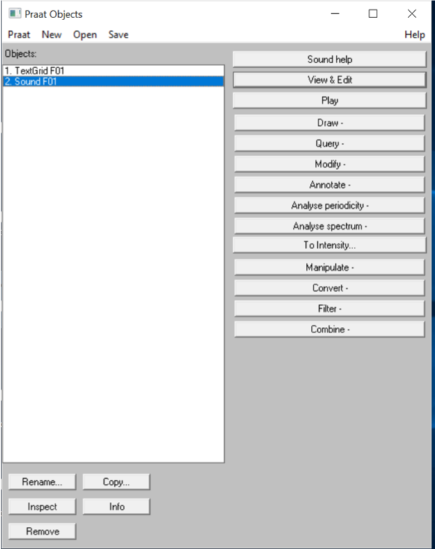
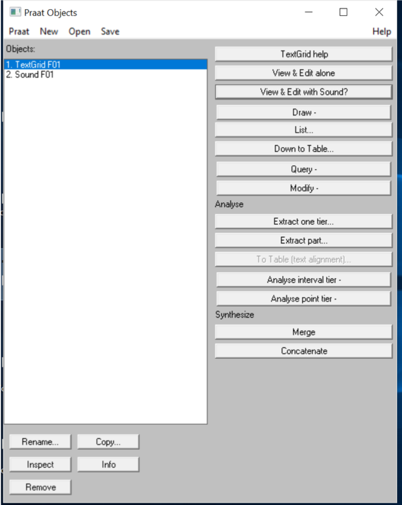
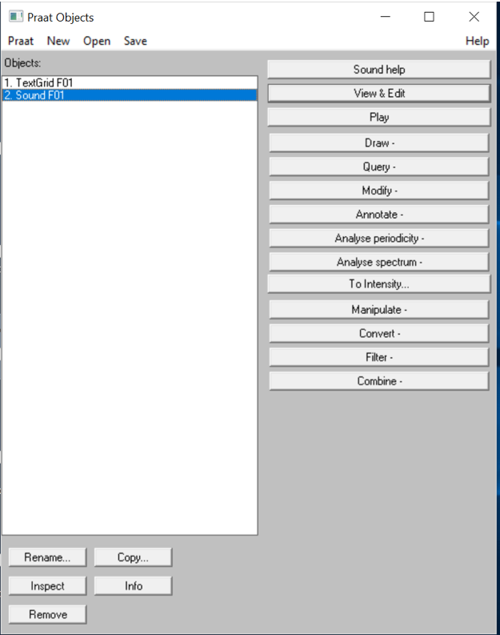
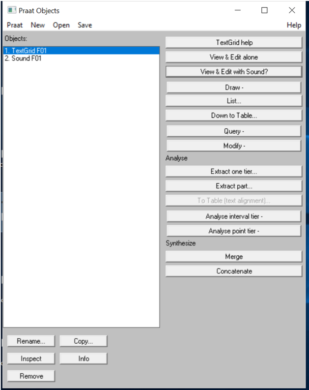
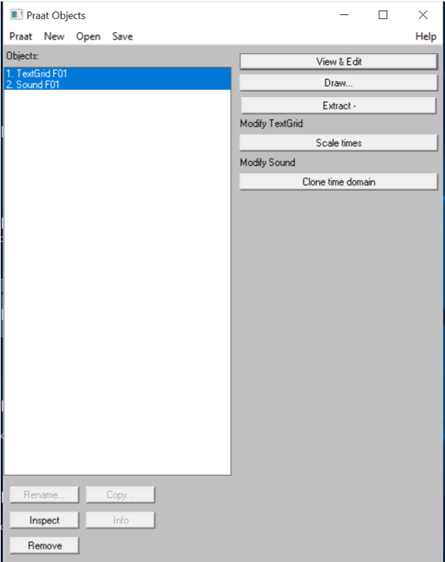

```{r setup, include=FALSE}
knitr::opts_chunk$set(echo = FALSE)
```

## Mi az a Praat szkript?

```{praat firstscript, echo = TRUE}
Read from file: "sound001.wav"
Extract one channel: 1
Save as wav file: "sound001_audio.wav"
Remove
```


* Egy szöveg
    + szövegfájlként menthető
    + bármilyen szövegszerkesztőben szerkeszthető.
* .praat kiterjesztéssel
* Amit a Praat programban tudunk lefuttatni.
* És a segítségével a beszédfeldolgozás számos részfolyamatát automatizálni tudjuk.

## Miért érdemes (kell) automatizálni a beszédfeldolgozást?

* Gyorsaság, munkafolyamat megkönnyítése.
* Pontosság, humán hibafaktor kiküszöbölése.
* Megismételhetőség.


## Mi automatizálható a beszédfeldolgozásban?

* Audio-fájlkezelés (megnyitás, konkatenáció, mentés)
* Zaj- és beszédmanipuláció, szintézis
* TextGrid-fájlkezelés (megnyitás, létrehozás, automatikus szünetjelölés, manipuláció, mentés)
* Nyelvi és akusztikus elemzés
* **Beszédelemzés annotátum alapján**
* Intervallumkinyerés
* Ábrák automatikus létrehozása
* ...

## Mi automatizálható a beszédfeldolgozásban?

<div class="columns-2">

  * Hangfájl esetén
    + Szintézis
    + Megnyitás, mentés, lejátszás
    + Ábrázolás
    + Manipuláció
    + Automatikus szegmentálás
    + Elemzés (idő, periodicitás, spektrum, intenzitás)
    <br><br><br>
  
```{r, out.height = "450px"}

```
</div>

## Mi automatizálható a beszédfeldolgozásban?

<div class="columns-2">
<br><br>
**Minden, ami az Object Window gombjaival végrehajtható.**
<br><br><br><br><br><br><br><br><br><br><br><br><br>

```{r, out.height = "450px"}

```

</div>

## Objektum- orientált (object oriented) szemlélet

<div class="columns-2">

```{r, out.height = "450px"}

```

```{r, out.height = "450px"}

```

</div>

## Objektum- orientált (object oriented) szemlélet

<div class="centered">
```{r, out.height = "450px"}

```
</div>

## Objektum- orientált (object oriented) szemlélet

* A Praat szkriptek különböző objektumokat (pl. Sound, TextGrid, Pitch, Harmonicity, Intensity, FormantGrid, Matrix, stb.) kezelnek.
* Minden objektumhoz más funkciók társulnak (~ különböző gombok).
    + A szkriptben mindig azok a funkciók tudnak csak lefutni, amik az aktuálisan kiválasztott objektummal működnek.
    + **Ezért nagyon fontos, hogy a szkriptben mindig a megfelelő objektum legyen kiválasztva!**
    + A Praatban manipulált vagy létrehozott objektumok nem léteznek a számítógép merevlemezén (nem egyenlők a felhasználó fájljaival), így ha azokra szükség van (tehát nem valamilyen méréshez ideiglenesen hoztuk őket létre), akkor **menteni kell**!

## A naplófájl használata - feladat

* Írjunk egy szkriptet!
    + Feladat: *Alkalmazzunk egy alul-áteresztő szűrőt a „sound001.wav”  hangfájlra, 0 és 400 Hz közötti frekvenciákon. Mentsük el az új fájlt „sound001_filtered.wav” néven.*
* Mi a cél?
    + Olyan folyamatok automatizálása, amit az Object ablakból manuálisan is el tudnánk végezni.
* Első lépés
    + Csináljuk meg manuálisan!

## A naplófájl használata
* Nyissuk meg a PraatSzkript szerkesztőablakát (Praat > New Praat Script).
    + A Praat futása során minden felhasználói tevékenységünket naplózza.
    + Ez a Paste History (Ctrl+H ) paranccsal illeszthető be az aktuálisan szerkesztett szkriptbe.
    + Így kinyerhetők a manuálisan végrehajtott tevékenységek automatikus lefuttatásához szükséges szkriptsorok.
    + **A naplófájlból beillesztett sorok átírása jó kiindulópontja az automatizálásnak.**

##Kommentelés
* A beszédfeldolgozásban használt szkriptek általában bonyolultak.
* Fontos, hogy a szkriptek értelmezése könnyű legyen…
    + Saját magunknak, ha később használjuk az adott szkriptet
    + Másoknak is!!!
* Komment: olyan sor a kódban, melyet számítógép nem vesz figyelembe, hanem a szkript átláthatóságát javítja, értelmezését teszi lehetővé emberek számára.
* **Komment kezdése PraatScript-ben: #**, (esetleg ;)
    + A teljes sor (A következő Enter-ig komment lesz)

*Kommenteljük fel a szkriptünk minden vonalát!*

##Online források I.

* Első lépés: keress rá!!!
    + A legtöbb elemzési/manipulációs részfolyamatra hozzáférhető valamilyen szkript online.
    + DE: valamilyen szinten mindig testre kell szabni!
    + DE: lehet régi PraatScript szintaxissal!
* **FONTOS: A nem anonim szkripteket (a legtöbb ilyen) valamilyen formában le kell hivatkozni, ha részben is, de felhasználod!!!**

##Online források II. - Szkriptgyűjtemények

* https://sites.google.com/site/praatscripts/
* http://phonetics.linguistics.ucla.edu/facilities/acoustic/praat.html

