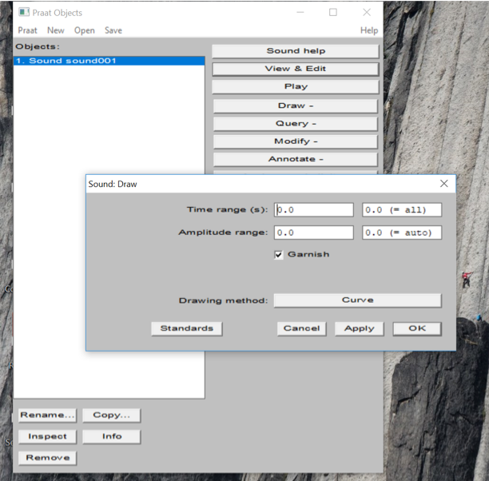
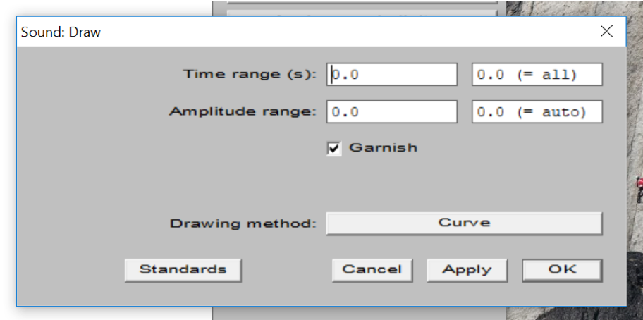

```{r setup, include=FALSE}
knitr::opts_chunk$set(echo = FALSE)
```

## Mik azok a funkciók?
<div class="columns-2">

```{praat getDur, echo = TRUE}
selectObject: "sound001"
Get total duration
```


```{r, out.width = "340px"}
knitr::include_graphics("img/getTotalDurFunctionGUI.png")
```

<br><br>

* Az Object window gombjaival elérhető műveletsorok
    + Ismétlés: ezek a műveletsorok objektumonként külömböznek (objektumorientált szemlélet).
    + DE vannak olyan funkciók is, amik több objektumtípussal is működnek.
</div>

## Hogy épül fel egy funkció?
<div class="columns-2">

```{praat draw, echo = TRUE}
selectObject: "sound001"
Draw: 0, 31.184399092970523,
      0, 0, "yes", "Curve"
```
  
```{r, out.width = "340px"}

```

<br>

* Argumentumok
    + A műveletsor végrehajtását meghatározó paraméterek.
    + A funkció gombjára kattintva felugró ablakban adhatók meg.
    + Rendelkeznek standard értékekkel (alapbeállítások).

</div>

##A funkciók szintaxisa

```{praat draw2, echo = TRUE}
selectObject: "sound001"
Draw: 0, 31.184399092970523, 0, 0, "yes", "Curve"
```

* Az argumentumokkal rendelkező funkciók szintaxisa:
    + Funkció neve : argumentum1, argumentum2, argumentumN
    + A funkciók mindig nagybetűvel kezdődnek, lehet bennük szóköz
    
```{praat getDur2, echo = TRUE}
selectObject: "sound001"
Get total duration
```

* Nem minden funkciónak vannak argumentumai!

##Argumentumok - értéktípusok
 
```{r, out.width = "500px"}

```

* <span style="color:firebrick">Numerikus</span>, 
* <span style="color:green">Szöveges</span>,
* <span style="color:purple">Logikai</span>,

```{praat draw3, echo = TRUE}
Draw: 0, 31.184399092970523,
      0, 0, "yes", "Curve"
```

## Mire jók a változók
<div class="columns-2">

<br><br><br>

```{r, out.width = "340px"}

```

<span style="color:grey; font-size: 12px">Kép: kjpargeter / Freepik</span>

<br><br><br>

* Tárolóhelyek a számítógép memóriájában.
    + A beléjük helyezett értékekkel objektumokkal műveleteket végezhetünk.
    + Különböző típusú értékeknek más-más tárolóhelyre lehet szüksége.
* *"Változók"*
    + Az értékek folyamatosan módosíthatók.
</div>

##Változók elnevezési konvenciói

```{praat variable naming conventions, echo = TRUE}
#minden esetben kisbetűvel kezdődnek
variable

#nem tartalmazhatnak szóközt!!!
#logikai tagolásuk több módon történhet

variableName
variable_name
variable.name
```

##Mire jók a numerikus változók?

###Feladat:

Rajzoltassunk oszcillogrammot a  "sound001.wav" időbeli középpontjától a végéig!

##Mire jók a numerikus változók?

###Feladat:

Rajzoltassunk oszcillogrammot a  "sound001.wav" időbeli középpontjától a végéig!

```{praat halfOscillo, echo = TRUE}
#t = 62.368798185941046/2
total = Get total duration
t = total/2

writeInfo: t
```

##Mire jók a numerikus változók?
* Bármilyen szám.
* Mérések végeredményeit tárolhatjuk numerikus változókban, így műveleteket végezhetünk velük, stb.
* variableName = 3.1
    + Bármilyen számmal vagy művelettel megadható a változó értéke.
    + Megfelelő kimenetű funkciók kimeneti értékével is egyenlővé tehető (lásd Get total duration).
 
```{praat halfOscillo2, echo = TRUE}
t = 31.1844
t = 62.368798185941046/2

total = Get total duration
t = total/2
```

##Változók használata argumentumként

###Manuálisan:
```{praat manualVSwithVariables1, echo = TRUE}
selectObject: "Sound sound001"
Get total duration
#megnézni az eredményt
#számológéppel elosztogatani kettővel
#beírni kézzel a felugró ablakba
Draw: 0, 31.184399092970523, 0, 0, "yes", "Curve"
```

###Változókkal:
```{praat manualVSwithVariables2, echo = TRUE}
selectObject: "Sound sound001"
total = Get total duration
t = total/2
Draw: t, 31.184399092970523, 0, 0, "yes", "Curve"
```

##Sztring változók

* String: szöveges változótípus.
* Szöveges információt főként az annotáció (TextGridek) elemzésekor, fájlok eléréséhez, illetve a szkript által előállított output létrehozásához használunk. (És ezen kívül még egy csomó helyen 🙂).
* szintaxis
    + variableName$ = „szöveg”
    + A változó nevének végén mindig dollárjel!
    +Szöveget mindig idézőjelben ("szöveg" vagy 'szöveg') adunk meg!


```{praat string introduction, echo = TRUE}
quote$ = "Nolite te bastardes carborundorum"
writeInfoLine: quote$

selectObject: "TextGrid tgrid001"
label$ = Get label of interval: 1, 2
writeInfoLine: label$
```

##Sztringek összefűzése

```{praat string concatenation, echo = TRUE}
textBeforeLabel$ = "Az intervallum címkéje: "

selectObject: "TextGrid tgrid001"
label$ = Get label of interval: 1, 2

result$ = textBeforeLabel$ + label$
writeInfo: result$

writeInfo: textBeforeLabel$ + label$ + "."
```

##Numerikus operátorok

  | 
--- | -------------
+  | összeadás
-  | kivonás
*  | szorzás
/  | osztás
div  | bennfoglalás
mod  | bosztás maradéka
x^y | hatványozás
< <= > >= | összehasonlítás


##Szintaxis összefoglaló

```{praat syntax sum up, echo = TRUE}
#komment

#váltózók definiálása
  #numerikus
  variableName = 5
  variable_2  = 13.2
  #sztring
  variable$ = „text”

#funkciók
  #argumentum nélkül
  Get total duration
  #argumentumokkal
  Get label of interval: 1, 2
```