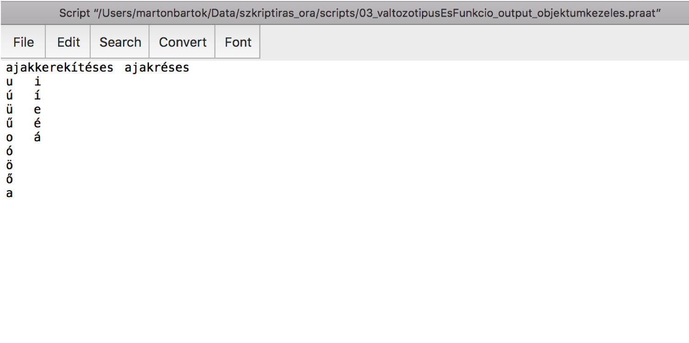
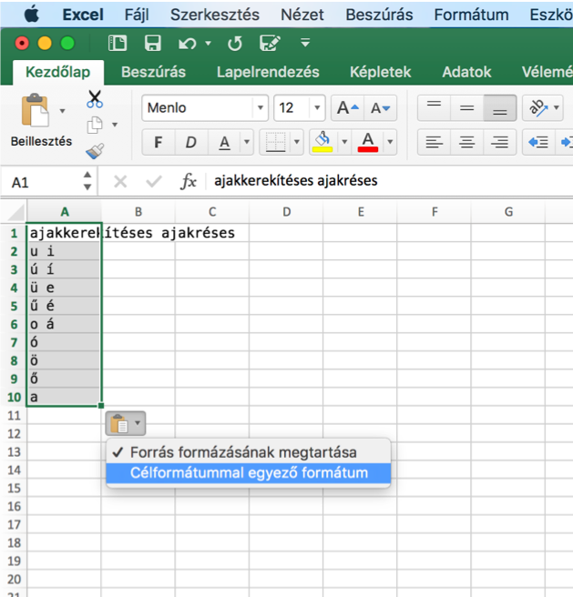
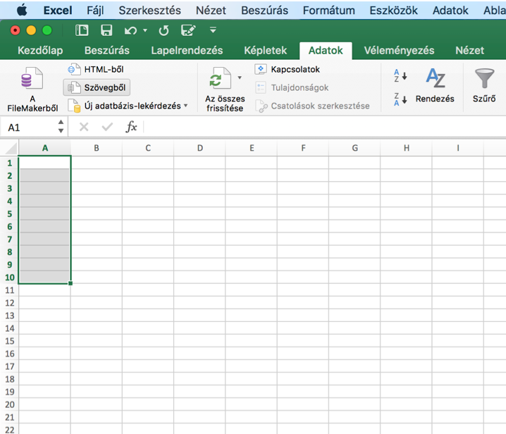
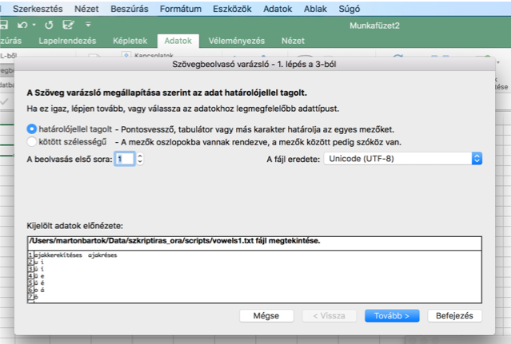

```{r setup, include=FALSE}
knitr::opts_chunk$set(echo = FALSE)
```

## Szintaxis összefoglaló

```{praat syntaxRecap, echo = TRUE}
#komment

#váltózók definiálása
  #numerikus
  variableName = 5
  variable_2  = 13.2
  #sztring
  variable$ = „text”

#funkciók
  #argumentum nélkül
  Get total duration
  #argumentumokkal
  Get label of interval: 1, 2
```

##Output

Nyerjük ki a `sound001.TextGrid` intervallumainak időtartamértékeit és címkéit!

* 0. lépés: mit akarunk kezdeni az adatokkal?
* Az azonos lekérdezések különböző értékeit együtt kezelni, **összehasonlíthatóvá tenni!**
  + Rendszerezés, táblázatos formában
  
##Info parancsok 

-| Töröl mindent maga előtt | Az előző szöveghez fűzi hozzá magát
----------|----------|----------
új sort kezd maga után|writeInfoLine|appendInfoLine
nem kezd új sort maga után|writeInfo|appendInfo

##Little string-ek

A Praat memóriájában eleve létező, megadott értékű stringek

```{praat littleStrings, echo = TRUE}
#tabulátor
tab$

#új sor
newline$
```

#Gyakorlás

Output

##Irasd ki a táblázatokat az info windowba!

<div class="columns-2">

ajakkerekítéses|ajakréses
----------|----------
u|i
ú|í
ü|e
ű|é
o|á
ó|
ö|
ő|
a|

-|palatális|veláris
----------|----------|----------
felső|i, í, ü, ű|u, ú
középső|ö, ő, é|o, ó
alsó|e|a, á

##Táblázatok az info windowban 😫

```{r, out.width = "700px"}

```

##Táblázatok exportálása Excelbe másolással  😐 
<div class="columns-2">
* Másolás az info windowból (Ctrl + C)
* Beillesztés Excelbe
  + Célformátummal egyező formátum!!!

<br><br><br><br><br>

```{r, out.width = "340px"}

```

##Táblázatok exportálása Excelbe fájlból 😃
<div class="columns-2">

* Mentés az info windowból (Ctrl + S)
    + Megfelelően elnevezett .txt fájlba
* Karakterkódolás UTF-8?
    + Jó még az excelbe importálás előtt ellenőrizni
    + Szövegszerkesztő: Save with encoding
* Excel: Adatok > Adatok beolvasása szövegfájlból
* R: ``readr::read_delim("dataset.csv", "\t", na = "--undefined--")``

```{r, out.width = "340px"}

```

##Adatok beolvasása szövegfájból
<div class="columns-2">
```{r, out.width = "450px"}

```

```{r, out.width = "450px"}
knitr::include_graphics("img/excelImport2.png")
```

#Objektum- (és fájl) kezelés

##Ismétlés: fájl vs. objektum

fájl|objektum
----------|----------
Merevlemezen, vagy más fizikai/online tárhelyen létezik.|A Praat memóriájában létezik, amíg a program fut.
Kiterjesztése van (pl. .txt, .wav, .textGrid stb).|Típusa van (pl. Sound, TextGrid, Table, List, FormantGrid stb).

##Fájl--objektum átjárás

* Fájlból objektum
    + `Read from file: eleresiut$`
* Objektumból fájl
    + `Save as text/WAV file: eleresiut$`
    + Felülírjuk az adott néven létező fájlt!
    
## Elérési út

* Direkt – a merevlemezen való elhelyezkedés
    + `"C:/Users/Gezu/titkos_projekt/helloszia.wav"`
    + `"D:/Adat/felvetelek/karaoke.wav"`
* Relatív – elhelyezkedés a szkripthez képest
    + `"heloszia.wav"` – a szkripptel egy mappában
    + `"../heloszia.wav"` – a szkriptet tartalmazó mappát tartalmazó mappában közvetlenül
    + `"../asitasok/rovid/helloszia.wav"`

##Objektumkezelés - kiválasztás

* A szkript lefutása folyamán változtatni akrjuk, hogy mivel dolgozunk/dolgoznak a funkciók
    + `selectObject: 1` - sorszám
    +  `selectObject: "Sound sound001"` - Objektum neve (`"Típus SPACE fájlnévkiterjesztésnélkül"`)
* De ezeket az infókat (sorszám, név) nem mindig tudjuk, főleg, ha új objektumok jönnek létre a szkriptben 😨
  + Valahogyan el kellene tárolni egy általunk megadott nevet a különböző objektumokhoz, hogy aztán a névvel tudjuk elérni azokat.
  
##Objektumok beleírása változókba

* Mivel a létrehozott objektumok a Praat memóriájában léteznek, ugyanúgy beleírhatók változókba (berakhatók névvel ellátott dobozokba), mint a numerikus, vagy sztring értékek).
    + Ez nagyon menő, igyekezzünk minél többet használni!
* Ismétlés: numerikus értékek beleírása változókba
    + `x = 42` vagy `x = 2*21` vagy `n = Get number of intervals: 1`
    + Érték, művelet eredménye vagy funkció eredménye
* Hogyan hozunk létre objektumokat???
    + `Read from file: "sound001.wav"` vagy `Reverse`, `Extract part: a, b` stb.
    + Read from file paranccsal, funkciókkal
* `godFather = Read from file: "sound001.wav"`